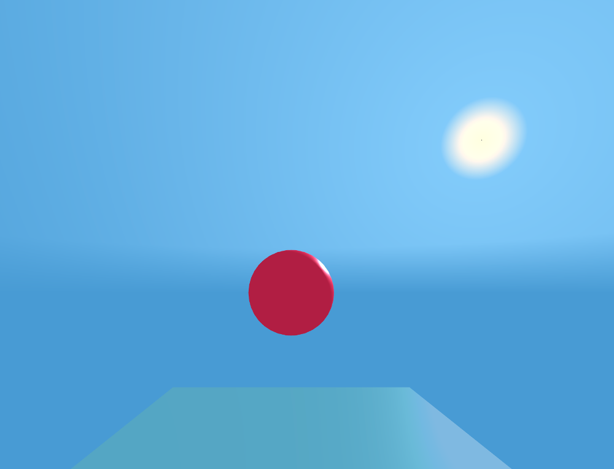

aframe-simple-sun-sky
===

An [A-Frame](https://aframe.io) [WebXR](https://www.webxr.community/) sky primitive using a simple (and fast) gradient away from the sun.
Saves your GPU power for the terrain!
Does *not* include any directional lighting.  You may need to set sun-position on other elements to match.



[live example scene](https://dougreeder.github.io/aframe-simple-sun-sky/example.html)

When the sun goes below the horizon, you might want to switch to a different sky.

Include using 
```html
<script src="https://unpkg.com/aframe-simple-sun-sky@^1.2.2/simple-sun-sky.js"></script>
```


Basic use:
```html
<a-simple-sun-sky sun-position="1 0.1 0"></a-simple-sun-sky>
```


The sky fades to fog-color near the horizon.
If you use fog in your scene, set fog-color the same or very similar to your fog.
If you don't use fog, set fog-color to a grayish variant of your sky colors.
The special value 'none' will disable the horizon effect, for those rare worlds that are all sky and no land.
```html
<a-simple-sun-sky sun-position="1 0.1 0" fog-color="#5681ac"></a-simple-sun-sky>
```


Setting the colors of the sky:
```html
<a-simple-sun-sky sun-position="-1 1 -1" light-color="#87cefa" dark-color="#00bfff" fog-color="#74d2fa"></a-simple-sun-sky>
```

Adding lights so shadows work correctly:
```html
<a-simple-sun-sky sun-position="0.7 0.4 -1"></a-simple-sun-sky>
<a-entity light="type: ambient; color: #BBB"></a-entity>
<a-entity light="type: directional; color: #FFF; intensity: 0.6" position="0.7 0.4 -1"></a-entity>
```


Increasing radius (default 5000) of sky sphere (increase the `far` parameter of the camera, too):
```html
<a-simple-sun-sky sun-position="1 0.1 0" radius="30000"></a-simple-sun-sky>
```


You can change any of the colors on the fly, except changing fog to or from 'none'.
